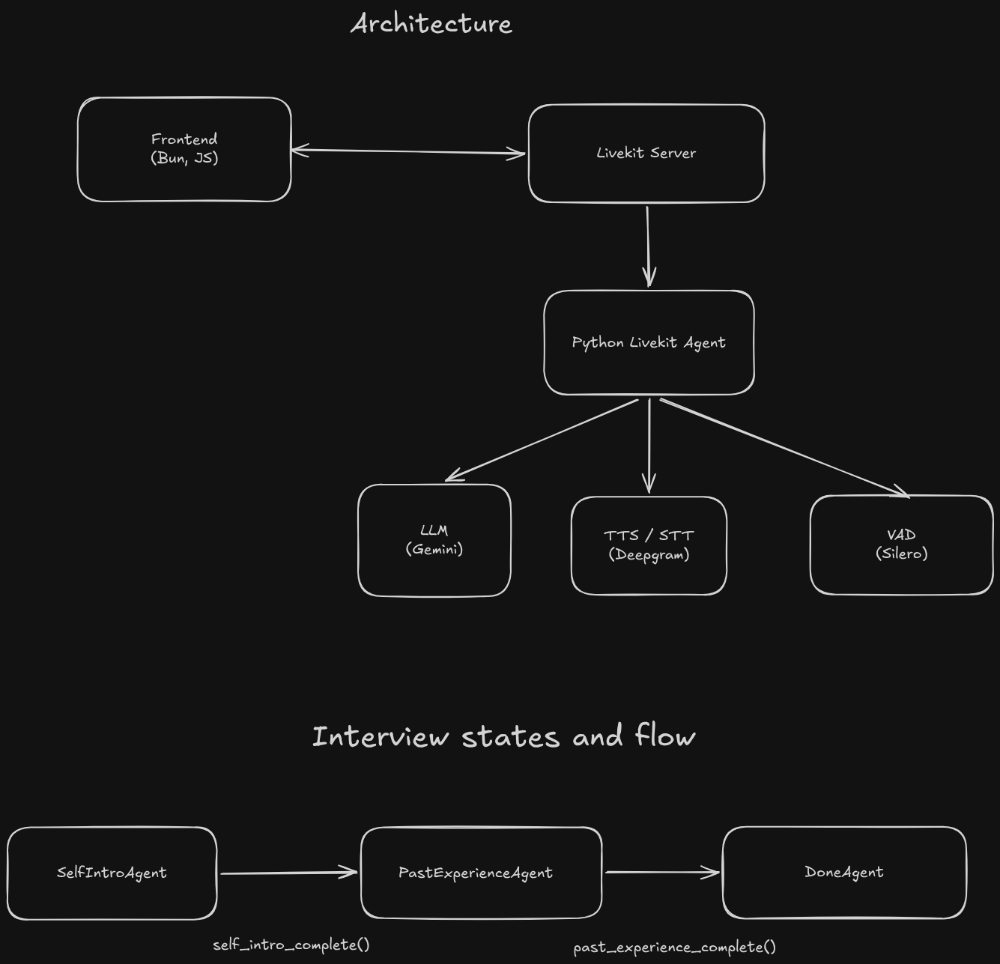
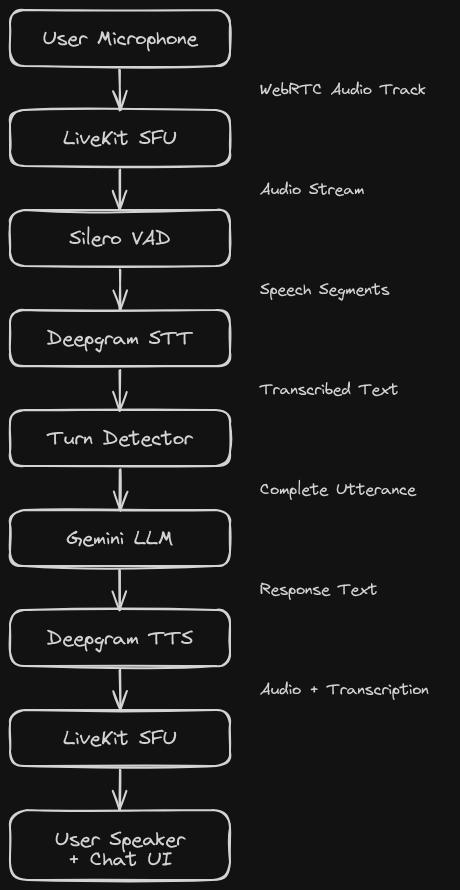

# LiveKit Interview Assistant

## Architecture Overview



---

## Backend

### Technology Stack

| Component       | Technology                                       | Purpose                          |
| --------------- | ------------------------------------------------ | -------------------------------- |
| Agent Framework | `livekit-agents` ~1.0                            | Agent lifecycle, room management |
| LLM             | `livekit-plugins-google` (Gemini 2.5 Flash Lite) | Conversational AI                |
| STT             | `livekit-plugins-deepgram`                       | Speech-to-text transcription     |
| TTS             | `livekit-plugins-deepgram`                       | Text-to-speech synthesis         |
| VAD             | `livekit-plugins-silero`                         | Voice activity detection         |
| Turn Detection  | `livekit-agents[turn-detector]`                  | English turn detection model     |

### Main Agent (`backend/main.py`)

#### InterviewData Dataclass

Shared state across all agents:

```python
@dataclass
class InterviewData:
    stage: str = "self_intro"           # Current interview stage
    handoff_done: bool = False          # Prevents duplicate handoffs
    name: Optional[str] = None          # Extracted candidate name
    current_role: Optional[str] = None  # Extracted current role
    intro_summary: Optional[str] = None # Summary of introduction
    self_intro_deadline_at: float = 0.0 # Timeout timestamp
    room: rtc.Room | None = None        # LiveKit room reference
```

The `broadcast_stage()` method publishes stage updates to all room participants via the `"stage"` data channel topic.

#### SelfIntroAgent (Stage 1)

**Purpose:** Gather candidate introduction (name, role, highlight)

**Behavior:**
1. On entry, sets a 60-second deadline timer
2. Prompts user to introduce themselves
3. Asks follow-up questions one at a time
4. When sufficient info gathered, calls `self_intro_complete()` function tool

**Deadline Fallback:** If 60 seconds elapse without handoff, the agent is instructed to summarize available information and proceed with best-effort values.

**Function Tool:**
```python
@function_tool
async def self_intro_complete(
    self,
    context: RunContext[InterviewData],
    name: Optional[str] = None,
    current_role: Optional[str] = None,
    intro_summary: Optional[str] = None,
) -> tuple[Agent, str]:
```

Returns a tuple of `(PastExperienceAgent(), bridge_message)` for seamless transition.

#### PastExperienceAgent (Stage 2)

**Purpose:** Deep-dive into a past project

**Behavior:**
1. Asks about a significant project contribution
2. Follows up on measurable impact
3. Probes for challenges/tradeoffs faced
4. Calls `past_experience_complete()` when done

#### DoneAgent (Stage 3)

**Purpose:** Graceful interview conclusion

**Behavior:** Thanks the user and offers to answer questions about the interview process.

#### Agent Session Configuration

```python
session = AgentSession[InterviewData](
    llm=google.LLM(model="gemini-2.5-flash-lite"),
    stt=deepgram.STT(),
    tts=deepgram.TTS(),
    vad=silero.VAD.load(),
    turn_detection=EnglishModel(),
    min_endpointing_delay=1.0,  # Minimum pause before considering turn complete
    max_endpointing_delay=6.0,  # Maximum wait time
    userdata=interview_data,
)
```

**Endpointing delays:** These control how long the system waits after speech pauses before determining the user has finished their turn. The 1-6 second range allows for natural pauses while preventing premature interruptions.

**Streaming Transcription:**

The session is configured with `sync_transcription=False` to enable real-time text streaming to the frontend:

```python
await session.start(
    agent=SelfIntroAgent(),
    room=ctx.room,
    room_options=room_io.RoomOptions(
        close_on_disconnect=False,
        text_output=room_io.TextOutputOptions(
            sync_transcription=False,  # Send text immediately, not synced with audio
        ),
    ),
)
```

### LiveKit Server Configuration (`backend/livekit.yaml`)

```yaml
port: 7880                    # HTTP/WebSocket API port
rtc:
  tcp_port: 7881              # TCP fallback for WebRTC
  port_range_start: 50000     # UDP port range for media
  port_range_end: 60000
keys:
  APIiR...: "..."             # API key/secret pair
```

### .env config (backend/.env)

```
LIVEKIT_URL="ws://127.0.0.1:7880"
LIVEKIT_API_KEY=""
LIVEKIT_API_SECRET=""

GOOGLE_API_KEY=""
DEEPGRAM_API_KEY=""

LIVEKIT_TOKEN=""
```

### Token Generator (`backend/tokengen.py`)

Generates JWT access tokens for client authentication:

```python
token = (
    api.AccessToken(os.environ["LIVEKIT_API_KEY"], os.environ["LIVEKIT_API_SECRET"])
    .with_identity(identity)
    .with_grants(
        api.VideoGrants(
            room_join=True,
            room=room,
            can_publish=True,
            can_subscribe=True
        )
    )
    .to_jwt()
)
```

**Grant permissions:**
- `room_join` - Permission to join the specified room
- `can_publish` - Permission to publish audio/video tracks
- `can_subscribe` - Permission to receive tracks from other participants

---

## Frontend

### Technology Stack

| Component     | Technology             | Purpose                           |
| ------------- | ---------------------- | --------------------------------- |
| Runtime       | Bun                    | TypeScript server runtime         |
| WebRTC Client | `livekit-client` 2.9.1 | Room connection, track management |
| Server        | Built-in `Bun.serve()` | Static file serving               |

### Server (`frontend/index.ts`)

Minimal Bun HTTP server serving static files:

```typescript
const server = Bun.serve({
  port: 3000,
  async fetch(req) {
    const url = new URL(req.url);
    // Route: / or /index.html → public/index.html
    // Route: /style.css → public/style.css (text/css)
    // Route: /app.js → public/app.js (application/javascript)
    // Default: 404 Not Found
  },
});
```

### Client Application (`frontend/public/app.js`)

#### State Management

```javascript
let room = null;           // LiveKit Room instance
let micTrack = null;       // Local audio track
let videoTrack = null;     // Local video track
let micEnabled = false;    // Microphone toggle state
let cameraEnabled = false; // Camera toggle state
let audioElement = null;   // Remote audio playback element
let pendingUserText = "";  // Buffer for user transcription
let userMessageEl = null;  // Current user message DOM element
let agentMessageEl = null; // Current agent message DOM element
```

#### Connection Flow

1. User enters LiveKit URL and access token
2. Creates new `Room` instance
3. Registers event handlers for data, tracks, and disconnection
4. Connects to LiveKit server
5. Automatically publishes local microphone track

#### Event Handlers

**Data Channel (stage updates):**
```javascript
room.on(RoomEvent.DataReceived, (payload, participant, kind, topic) => {
  if (topic === "stage") {
    const data = JSON.parse(text);
    updateStage(data.stage); // Updates UI stage indicator
  }
});
```

**Transcription Streaming:**
```javascript
room.registerTextStreamHandler("lk.transcription", async (reader, participantInfo) => {
  const isFinal = reader.info.attributes["lk.transcription_final"] === "true";
  const isUser = participantInfo?.identity === room.localParticipant?.identity;
  
  if (isUser) {
    // Accumulate final transcriptions for user messages
  } else {
    // Stream agent responses character-by-character
    for await (const chunk of reader) {
      streamedText += chunk;
      textDiv.textContent = streamedText;
    }
  }
});
```

**Audio Track Subscription:**
```javascript
room.on(RoomEvent.TrackSubscribed, (track, publication, participant) => {
  if (track.kind === Track.Kind.Audio) {
    audioElement = track.attach();
    document.body.appendChild(audioElement);
    audioElement.play();
  }
});
```

#### Media Controls

**Microphone toggle:**
```javascript
async function toggleMic() {
  if (micEnabled) {
    await room.localParticipant.unpublishTrack(micTrack);
    micTrack.stop();
  } else {
    micTrack = await createLocalAudioTrack({
      echoCancellation: true,
      noiseSuppression: true,
      autoGainControl: true,
    });
    await room.localParticipant.publishTrack(micTrack);
  }
}
```

**Camera toggle:**
```javascript
async function toggleCamera() {
  if (cameraEnabled) {
    await room.localParticipant.unpublishTrack(videoTrack);
    videoTrack.stop();
  } else {
    videoTrack = await createLocalVideoTrack({
      facingMode: "user",
      resolution: { width: 640, height: 480 },
    });
    await room.localParticipant.publishTrack(videoTrack);
    localVideo.srcObject = new MediaStream([videoTrack.mediaStreamTrack]);
  }
}
```

#### Text Chat

Messages are sent via the `lk.chat` topic:
```javascript
await room.localParticipant.sendText(text, { topic: "lk.chat" });
```

### UI Components (`frontend/public/index.html`)

| Component       | Purpose                                  |
| --------------- | ---------------------------------------- |
| Connection Form | LiveKit URL and token input              |
| Stage Indicator | Visual progress through interview stages |
| Video Container | Local camera preview with placeholder    |
| Chat Messages   | Scrollable message history               |
| Input Area      | Text input with microphone toggle        |

### Styling (`frontend/public/style.css`)

- **Dark theme** (#0a0a0a background, #e5e5e5 text)
- **Responsive layout** - Flexbox-based with media query at 768px
- **Animated microphone button** - Pulsing glow when active
- **Stage indicator** - Dot progression with active/completed states
- **Message bubbles** - User (white/right-aligned), Agent (dark/left-aligned)

---

## Running the Application

### 1. Start LiveKit Server

```bash
cd backend
livekit-server --config livekit.yaml
```

### 2. Generate Access Token

```bash
cd backend
uv run tokengen.py > token.txt
```

### 3. Start the Agent

```bash
cd backend
uv run main.py
```

### 4. Start the Frontend

```bash
cd frontend
bun run dev
```

### 5. Connect

1. Open `http://localhost:3000`
2. Enter LiveKit URL: `ws://localhost:7880`
3. Enter the generated token
4. Click Connect

---

## Environment Variables

Required in `backend/.env`:

| Variable | Description |
|----------|-------------|
| `LIVEKIT_API_KEY` | LiveKit API key (must match `livekit.yaml`) |
| `LIVEKIT_API_SECRET` | LiveKit API secret |
| `DEEPGRAM_API_KEY` | Deepgram API key for STT/TTS |
| `GOOGLE_API_KEY` | Google API key for Gemini LLM |

---

## Data Flow

### Voice Input Path


